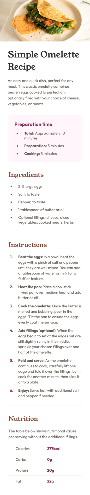

# Frontend Mentor - Recipe page solution

This is my solution to the [Recipe page challenge on Frontend Mentor](https://www.frontendmentor.io/challenges/recipe-page-KiTsR8QQKm). Frontend Mentor challenges help you improve your coding skills by building realistic projects.

## Table of contents

- [Overview](#overview)
  - [Screenshot](#screenshot)
  - [Links](#links)
- [My process](#my-process)
  - [Built with](#built-with)
  - [What I learned](#what-i-learned)
  - [Continued development](#continued-development)
  - [Useful resources](#useful-resources)
- [Author](#author)
- [Acknowledgments](#acknowledgments)

## Overview

### Screenshot

#### 📱 Mobile



#### 💻 Desktop


### Links

- Solution URL: [My Github repo](https://github.com/JiaHe35354/Recipe-page)
- Live Site URL: [recipe-page-jiah.netlify.app](recipe-page-jiah.netlify.app)

## My process

### Built with

- Semantic HTML5 markup
- CSS custom properties
- CSS Grid

### What I learned

While building this component, I practiced:

- Using CSS Grid to lay out two-column content similar to a table

- Structuring CSS into multiple files to make it more readable

- Using the ::marker pseudo-element to style bullet points in unordered lists and numbers in ordered lists

- Using padding-left to adjust the distance between the marker and the list item content

Here's a small snippet I'm proud of:

```css
.row {
  border-bottom: 1px solid var(--color-stone-150);

  display: grid;
  grid-template-columns: repeat(2, 1fr);
}
```

### Continued development

In future projects, I want to focus more on:

- Using CSS Grid to lay out entire pages

### Useful resources

- [Google Fonts - Young Serif](https://fonts.google.com/specimen/Young+Serif)
- [Google Fonts - Outfit](https://fonts.google.com/specimen/Outfit)
- [Custom bullets with CSS ::marker](https://web.dev/articles/css-marker-pseudo-element)

## Author

- Frontend Mentor - [@JiaHe35354](https://www.frontendmentor.io/profile/JiaHe35354)
